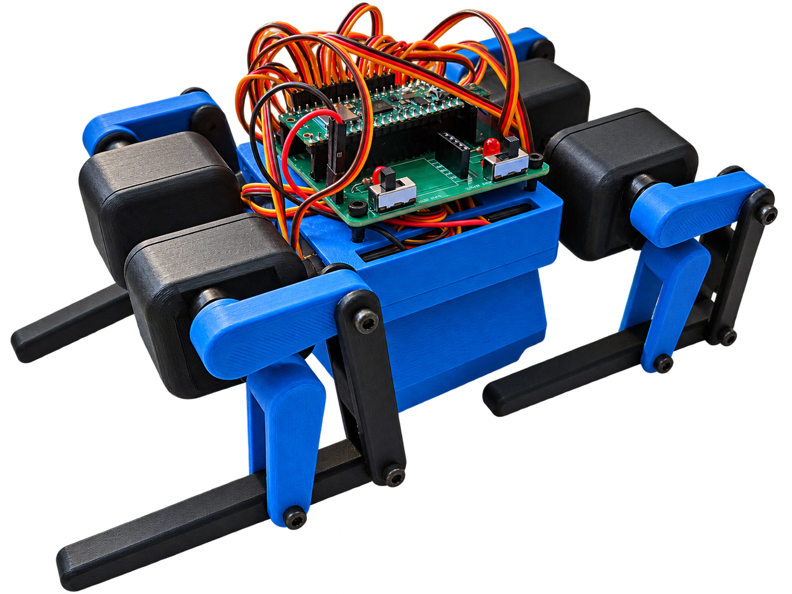
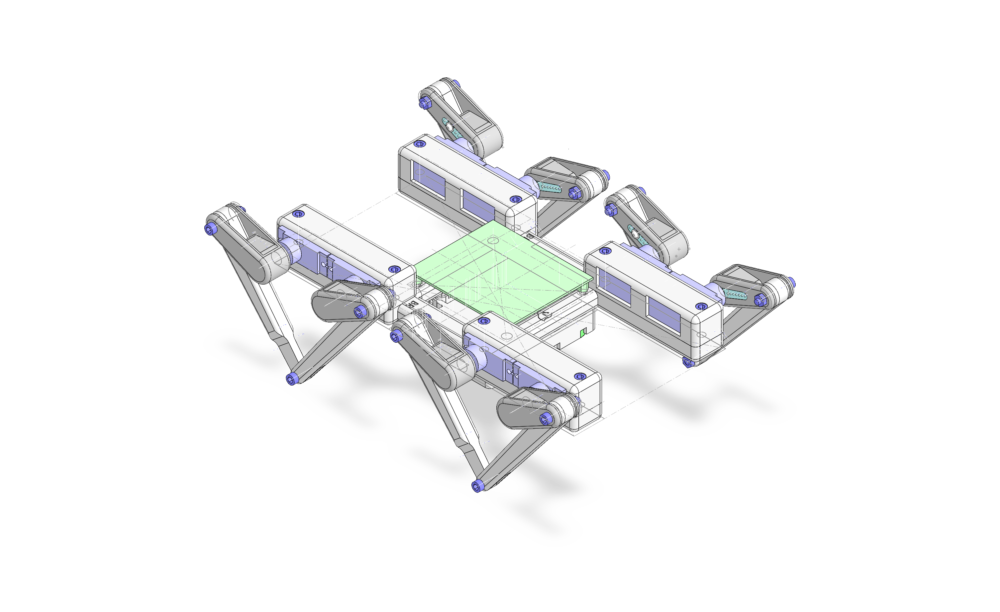
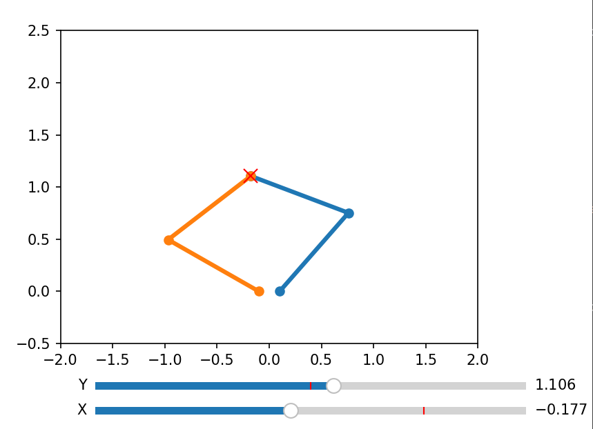
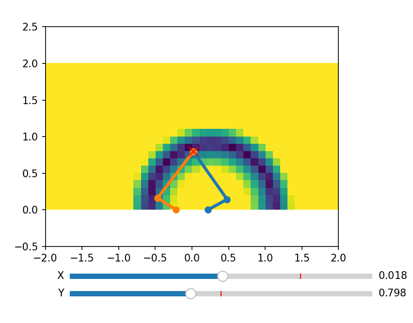
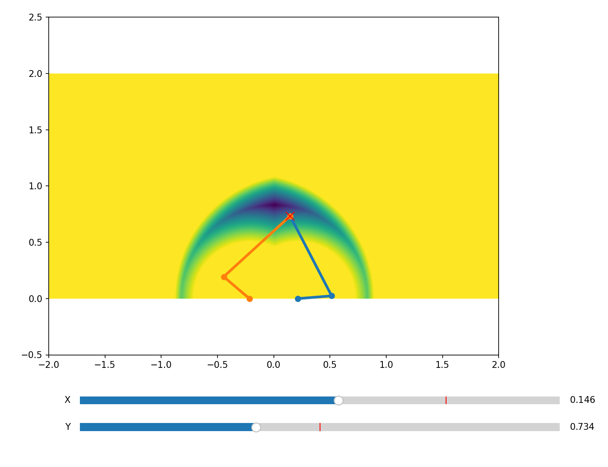
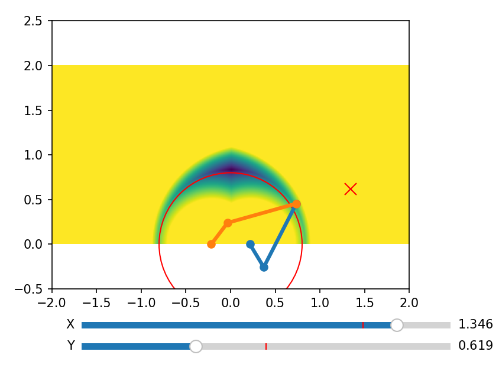
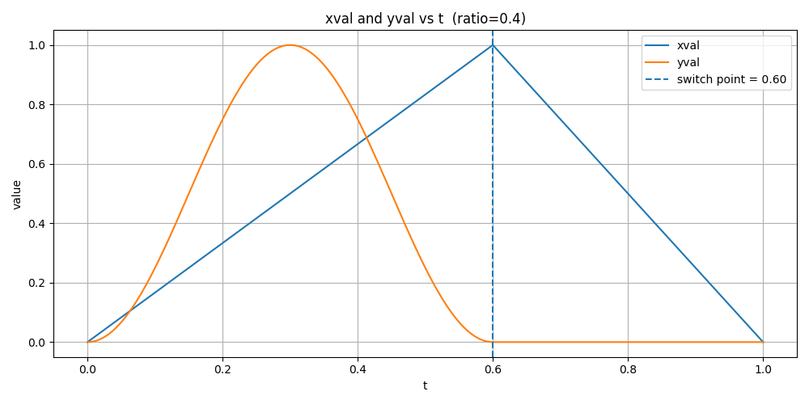
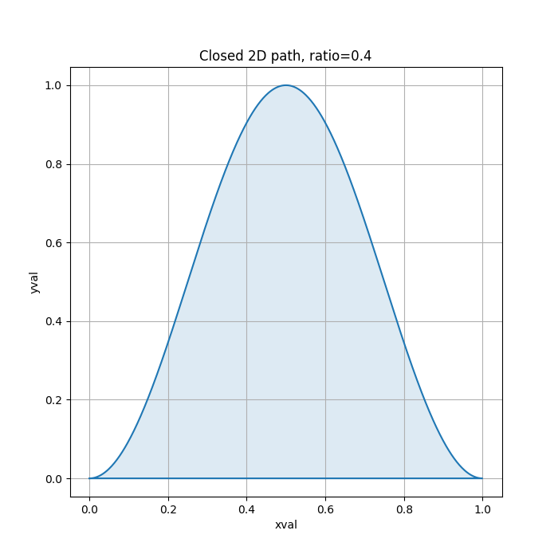
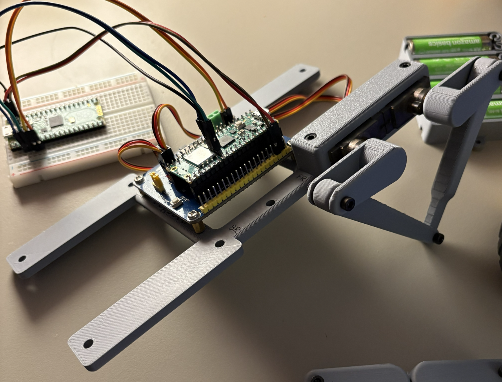
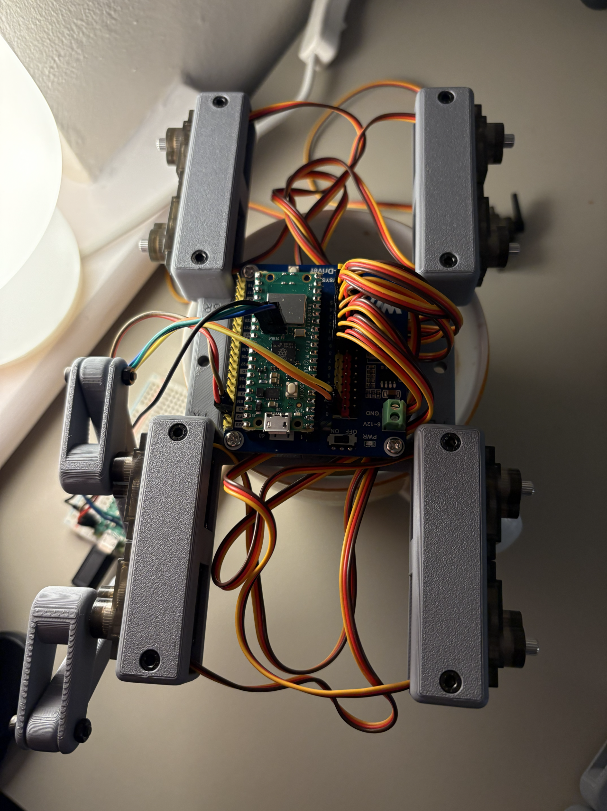

+++
title = "Building dogsbod: A quadruped robot"
date = 2026-03-13
tags = ["3D printing", "rp2040", "robotics", "highlights"]
categories = ["Writing"]
thumbnail = "dogsbod/dogsbod.png"
description = "I built a robot dog. This took me on a big adventure across whole new domains: mechanical engineering, 3D printing, robotics, Bluetooth firmware and debugging electronics."
+++



## Goal: Build a small, cheap and stupid quadruped robot dog

How hard could it be?


As it turns out, it *is* surprisingly difficult! The process required me to learn CAD, mechanical engineering, 3D printing, the Bluetooth protocol and how to actually debug electronics in practice.

In the end I did manage to get it walking, controlled with a DS4 controller over Bluetooth.

Come and join me on an adventure as we learn what it takes to build the simplest, cheapest, stupidest robot dog I can come up with.

## Initial Plan

In January I was [inspired](https://www.instructables.com/GoodBoy-3D-Printed-Arduino-Robot-Dog/) by a [bunch of](https://www.instructables.com/ESP32-Small-Robot-Dog/) [projects online](https://www.instructables.com/DogBot-V2-Make-Your-Own-Quadruped-Robot-From-Scrat/) and [various](https://www.youtube.com/watch?v=VhUvoV5XyRg) [YouTube](https://www.youtube.com/watch?v=iXmrPoqd8gs) videos explaining the process of creating a robot dog, and this got me excited enough to want to give it a try myself.

At the time of starting this project I didn't have a 3D printer and I hadn't used CAD software before.

The idea was to try and build a robot using the cheapest servos I could find, mostly for power and budget reasons, and then try to fit the robot's movement within those limits. I wanted to be able to run the robot from 4xAA batteries because I didn't want to jump straight to high power electronics. Lipo battery fires are scary.

I started out with this very simple BOM:

- [Miuzei 9g Metal Gear Micro Servo Motors](https://www.amazon.co.uk/gp/product/B0DGD55Q71?smid=ADX1E4W4DEI4I&th=1) x8
  - 1.8kg/cm torque @ 4.8V
  - 13.5g mass
- [Waveshare Pico Servo Driver](https://www.waveshare.com/wiki/Pico-Servo-Driver)
- [4x NiMH AA batteries](https://www.amazon.co.uk/AmazonBasics-Capacity-Pre-Charged-Rechargeable-Batteries-Black)
- [4x AA battery holder](https://thepihut.com/products/4-x-aa-battery-holder-with-on-off-switch)
- [Pack of M3 Nuts + Bolts](https://www.amazon.co.uk/dp/B0DC4688ZT)
- [Raspberry Pi Pico W](https://thepihut.com/products/raspberry-pi-pico-w)
- 3D printer filament

I also came up with an initial mass budget of ~20g per leg via some very rough/'finger in the air' torque calculations. This is definitely the wrong way to do it but I think it put me in the right order of magnitude.
```
1.8kg/cm torque

Pico + Servo Driver = 34g
Servos = 13.5g x 8 = 108g
NiMH x 4 = 30g x 4 = 120g
Battery holder 25g (assumed) = 25g

==> 287g without any plastic

assume 50% torque available because bad quality. 900g/cm.
900g/cm * 4 legs = 3600g/cm
3600g/cm / 10cm distance along each leg = 360g budget - 287g = 73g

18.25g per leg
```

I did some really rough power calculations.

```
Battery pack: 4× AA NiMH in series

    Nominal voltage: 4⋅1.2=4.8 V
    Typical capacity: about 2000–2500 mAh for decent AAs
    In series, voltage adds, capacity stays the same → call it a 2–2.5 Ah, 4.8 V pack

Servos: 8× Miuzei Micro Servos

    Rated operating voltage: about 3.5–6 V
    Stall current is 700 mA
    8 servos could theoretically hit 5–6 A if they all slam into stall at once
```

I found the 5-6A result quite worrying, but hoped that if they didn't all stall at the same time it would be ok? I pay for this mistake later on, but I do get further than I expected!

## CAD Design

After a week or so learning SolidWorks I came up with this design:



This allowed me to calculate the final mass budget:
```
Each leg is 24.19g x4 = 96.76g
Body is = 36.8g
Battery box is = 22.37g
=> 155.93g
Pico + Servo Driver = 34g
Servos = 13.5g x 8 = 108g
NiMH x 4 = 30g x 4 = 120g
=> 417.9g

360g budget => 16% over budget.
```

I was 5g over my intended per leg mass budget, though given I had reduced the torque by 50% to arrive at that original budget I decided this was good enough to proceed. So if I naively assume the servos will deliver their actual torque specs then I'm only at 58% of the mass budget.

## Electronics and Initial Firmware

On the electronics side, I set myself an initial goal of getting the waveshare servo board up and running, driving a single servo. 

I wired up another Pico I had lying around to act as a [Pico Debugger Probe](https://www.raspberrypi.com/documentation/microcontrollers/debug-probe.html) which makes flashing the firmware significantly less annoying: you can set things up in VS code to the point where mashing F5 compiles, flashes and then attaches the debugger. So you can have full debugging access, which I'm very used to/spoiled with from my game console development experience. Debuggers are a very powerful tool to have available, and are worth fighting for to gain that low level understanding of what's going on.

For that reason it's really worth spending the time to set up UART so you can printf what is going on inside the chip even though wiring UART correctly is a complete nightmare. I always get it the wrong way round.

My first attempt to get the waveshare board to move a servo didn't work, and in the process of figuring out why I accidentally shorted the 5V output and GND together with my multimeter probes. There was a terrifying moment where I saw an arc between the pins and then power to the whole board was lost, which I think was the efuse within my PC's USB ports. Luckily I didn't fry my PC's USB ports or even worse the whole PC itself but I **did** fry the buck converter on the waveshare board.

This was confirmed after a bit of (much more careful!) multimeter probing around the buck converter pins when connected to 5V.

In the end the problem turned out to be that I'd forgotten to turn on the 'SERVO POWER' switch on the waveshare board! ARGH. In my defence the schematic of my r1 waveshare board I'd bought many years ago had been updated to a new revision with better layout + power options so I don't actually have the schematic of the board I have.

As a result I learned it's a great idea to check in the datasheet of every component you own into Git. Don't assume your component's datasheet will be archived for you forever.

The firmware required to drive a servo really is simple. You [wobble the data pin](https://en.wikipedia.org/wiki/Pulse-width_modulation) at the rate the servo chip wants you to wobble the pin at. For the Miuzei servos I'm using they want a pulse width modulation (PWM) working pulse width of 500-2500 microseconds. This code assumes the PWM channels have been configured so each level is one microsecond long:
```c
#include "hardware/pwm.h"

static void set_servo_angle(int pin, int angle) {
    if (angle <= 0) angle = 0;
    if (angle >= 180) angle = 180;
    if (pin <= 0) pin = 0;
    if (pin >= NUM_SERVOS) pin = NUM_SERVOS - 1;
    pin += SERVO_MIN_PIN;
    uint32_t pulse_us = 500 + (angle * (2500 - 500)) / 180;
    uint32_t slice = pwm_gpio_to_slice_num(pin);
    uint32_t channel = pwm_gpio_to_channel(pin);
    pwm_set_chan_level(slice, channel, pulse_us);
}
```

With this I was able to get a bunch of servos moving about.

## IK Solvers and Five Bar Linkages

For the next phase of the plan I set the goal of buying a 3D printer and figuring out the inverse kinematics (IK) of each leg allowing the conversion of a 2D position (since the v1 robot only has two degrees of freedom per leg) relative to each leg into a pair of motor angles to command the servos to move to.

I chose the [Bambu Lab P1S](https://uk.store.bambulab.com/products/p1s) 3D printer. My goal was to have a tool instead of a 3D printing hobby and this printer has been reliable so far.

The initial design called for what's known in robotics land as a 'Five Bar Linkage' per leg. I started by creating a quick solver in Python. You can work forwards and backwards from the target position via relatively simple trig.

I ended up writing this in Python, visualising it with matplotlib.



Here is the core algorithm for two bar and five bar IK:
```python
def inverse_kinematics_two_bar(x, y, flip=False):
    cos_theta2 = (x**2 + y**2 - l1**2 - l2**2) / (2 * l1 * l2)
    if cos_theta2 > 1.0:
        cos_theta2 = 1.0
    if cos_theta2 < -1.0:
        cos_theta2 = -1.0
    theta2 = math.acos(cos_theta2)
    if flip:
        theta2 = 2.0*math.pi - theta2
    k1 = l1 + l2 * math.cos(theta2)
    k2 = l2 * math.sin(theta2)
    theta1 = math.atan2(y, x) - math.atan2(k2, k1)
    return theta1, theta2

def inverse_kinematics_five_bar(x, y):
    hjw = joint_width*0.5
    lt1, lt2 = inverse_kinematics_two_bar(x-hjw, y)
    rt1, rt2 = inverse_kinematics_two_bar(x+hjw, y, True)
    return lt1,lt2,rt1,rt2
```

The problem with this naive algorithm is that joint limits are not respected, and our servos are limited both by joint angle and the relative position of the legs. We needed to find a way to 'solve' the IK such that the servo angles could not be commanded into an invalid position. I wasn't sure about how strong 3D prints were at the time, so I didn't want to break anything just because I wrote the software wrong!

A valid IK target position is one that can be reached by the leg end points, which in robotics land is called the 'reachable workspace'. For the two bar linkage I chose to calculate this by taking the dot product of the upper and lower leg forward vectors. This is probably not the most rigorous or academic method but it does appear to work. This visualisation shows which positions are reachable:



If you look at where both linkages can reach you end up with an interesting lozenge shaped 'reachable workspace'. Both actuators must be kept within this at all times somehow:



Since you only know if a joint position is valid by calculating it, how do you find the nearest point in the 'reachable workspace' when you are already outside of that region?

The solution I came up with involved finding a circle that intersected the reachable workspace (shown in red). Then when a point is outside the reachable workspace you iteratively move the target position towards the red circle until you find a valid IK position. You could probably do a gradient descent to make it converge faster but I didn't bother it was fast enough, even in Python!

This allowed the legs to stretch as far as they could to the target, without exceeding joint limits or getting the joints into a 'degenerate' (pointing in a straight line at the target) position.



As mentioned earlier the problem with this approach is it's iterative: you need to iterate multiple times when outside the acceptable IK range to find a valid IK position. With four legs to position on a microcontroller with no hardware floating-point unit (FPU) I decided I could pre-compute the joint angles via a lookup table `(X,Y) => (motor A angle, motor B angle)` across the entire IK range. This avoids a bunch of iteration, software floating point maths and trig at runtime, at the cost of a little bit of memory.

Since all the legs are the same, I can re-use this lookup table across the robot. The joint angles are 0-180 which fits in a byte, and the accuracy of the servos themselves is low enough that you can get away with a pretty coarse table of 128 'pixels' wide by 32 'pixels' high. So a total of 8KB of storage is required for the ik lookup table.

At runtime you effectively lookup this table and do a bilinear interpolation between the adjacent cells to get your target joint angles.

```c
// generated by ik.py; x = -0.6 -> 0.6; y = 0.5 -> 1.0; output = left degrees, right degrees
const unsigned char arm_pos_arr[128][32][2] = {
  {{171,70},{171,71},{171,73},{171,75},/*and so on...*/
};
```

With all of this working I was ready to test it on the real thing. I printed one of the legs and after a couple of failed 3D prints got this result. In this test I was manually moving the target IK position via UART:


## Higher Level Motion Planning

The final goal was to figure out how to make the entire robot move using all four legs, controlled via a DS4 controller over Bluetooth. The plan was to put the desired heading rotation and speed on the left stick, and pitch offset on the right stick.

One solution to this problem is to effectively run a fixed leg animation on each leg built out of maths:
```py
if t < (1.0 - ratio):
    t2 = (t * 0.5) / (1.0 - ratio)
else:
    t2 = 0.5 + (((t - (1.0 - ratio)) * 0.5) / ratio)
xval = 1.0 - abs((t2-0.5)*2.0)
yval = ((math.cos((t2+0.25)*math.pi*4.0)*0.5)+0.5) if t2 < 0.5 else 0.0
```

Which looks like this for the ik target position's `xval` and `yval` over time `t`.


The 'ratio' value controls how quickly the leg moves along the ground when the leg is moving forwards. Increasing the ratio spends more time returning the leg to the start position which means less time moving it along the ground.

If you plot the X and Y values over time you end up with this leg motion:


If you run this on all 4 legs then the robot will rock forwards and backwards and not move. To achieve forward and backward movement you offset the starting time `t` relative to each other.

This means each leg has two parameters: `offset` and `ratio`. The offset on each leg controls the order in which the legs move, and the simplest approach is to pick a leg ordering that keeps the centre of mass (COM) of the robot inside the 'support polygon' which for this robot is a triangle made out of the legs that are currently touching the ground.

I went with a fixed walking order to keep things simple, even though this isn't optimal. I built a mini 'simulator' in Python/matplotlib that helped me verify the algorithm without having to iterate in the hardware itself. That gave this result:


Speed is controlled by controlling how quickly the simulation moves forwards/backwards globally.

## Hardware and Final Assembly

I printed and assembled the final components; the main body, 3 more sets of legs along with the servo controller, servos and battery box. The breadboard in the photos you can see is acting as the pico debugger. 

I was also experimenting with a custom battery box, but the batteries kept falling out because the 3D printed springs were not strong enough! I decided an off the shelf battery box worked best for now.




Once I'd ported the python algorithm over to the C firmware this allowed the first test to take place.


As you can see, lots of room for improvement:
- Lack of friction between the legs and the desk
- The debugger breakout stops it moving along the ground and back again very well
- No steering
- No Bluetooth control (controlled over UART)

Let's fix those things next!

## Bluetooth Firmware and Implementing Turning

Turning is controlled by multiplying the horizontal IK movement (the `xval` in the python maths above) by which side of the body you are on:

| steering | -1.0 | -0.5 | 0.0 | 0.5 | 1.0  |
|----------|------|------|-----|-----|------|
| left     | 1.0  | 1.0  | 1.0 | 0.0 | -1.0 |
| right    | -1.0 | 0.0  | 1.0 | 1.0 | 1.0  |

So now we can control the robot using a single left stick for forward/back and left/right. If you also add a small y offset based on the right stick you can implement leaning as well.

For the Bluetooth controls I wrote my own Bluetooth firmware implementation for the DS4 controller which used the [btstack](https://github.com/bluekitchen/btstack) library which can talk to the `CYW43439` chip on board the Pico W.

To do that I had to manually figure out the Bluetooth hardware ID of my DS4 controller I had lying around. You can do this by implementing a Bluetooth scan and log the IDs you can see over UART.

Once you've paired the controller it expects various ack packets. Once these have been sent correctly it spams you with Bluetooth packets containing the state of the pad and buttons. All of this is provided in the `hid_host_register_packet_handler(packet_handler);` callback once you've initialised the `btstack` library correctly.

Once I got that working it was pretty easy to extract the left and right stick states, apply these to the motion algorithm and command the motors to move to that position. To allow the Bluetooth firmware to coexist nicely with the motion control I used a `btstack_run_loop` configured to run every 32ms. 
```c
btstack_run_loop_set_timer(&ik_tick, 32);
btstack_run_loop_set_timer_handler(&ik_tick, ik_tick_handler);
btstack_run_loop_add_timer(&ik_tick);
```
This allowed `btstack` to take full control of the main loop in the rp2040 via the `btstack_run_loop_execute()` call.

# Conclusion and what I learned

Here is the final full walking + messing about video!


What did I learn from this project?
- 4xAA NiMH batteries are definitely not enough power but you can't argue with the budget and safety advantages!
- Cheap servos are usable but you can quickly hit their torque limits
- Simulation is a powerful tool that avoids iterating directly on hardware
- Nothing beats iterating directly with hardware to find weird issues
- Be very **very** careful not to short pins when probing with multimeters; have a plan of action and think through the circuit before acting. Debugging can cause accidental damage which is completely different from software.

What would I improve?
- Fully custom PCB designs for both the debugger and the robot itself
- Improved leg designs; can we make it look more like an actual leg?
- Can we move beyond 4xAA batteries to a strong enough power system?
