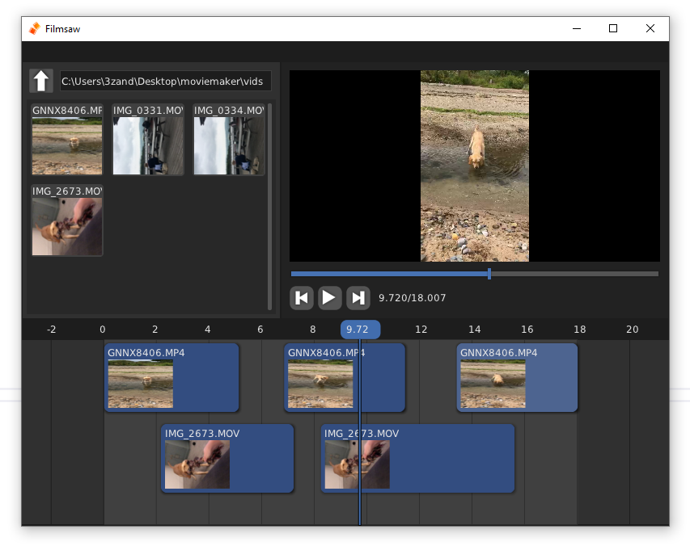

+++
title = "Filmsaw"
date = 2022-09-13
tags = ["C","ffmpeg","sokol"]
categories = ["Projects"]
thumbnail = "filmsaw/filmsaw.png"
description = "A barebones movie editor inspired by Windows Move Maker for the Handmade Network Wheel Reinvention Jam"
+++

A barebones movie editor inspired by Windows Movie Maker. Made during the Handmade Network [Wheel Reinvention Jam](https://handmade.network/jam).

Written in C using the Sokol Libs for graphics, window setup and input and FFmpeg to actually open and render the movie files to the screen.

You can [try it out for yourself](https://github.com/zanders3/filmsaw/), but it's pretty bare bones. It was just for fun and learning. I just about managed to get it to edit some videos, however I am not a video editor and in any case ffmpeg was really doing all the heavy lifting. I sure learned a lot though!

