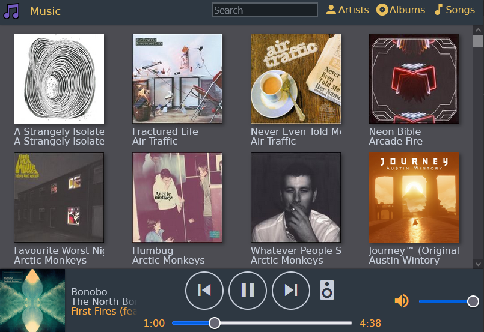
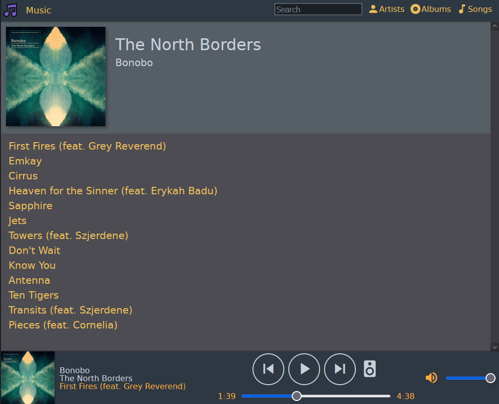
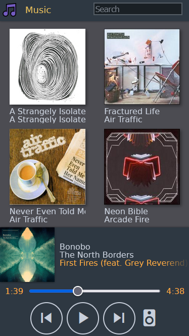

+++
title = "Music Box"
date = 2023-01-18
tags = ["golang","sonos-hacks","raspberrypi"]
categories = ["Projects"]
thumbnail = "musicbox/screen1.png"
description = "A self hosted music player that runs on a Raspberry Pi inside your local network"
+++

A music player app that streams music from your raspberry pi within your local network. 
It can also discover, control and stream music to Sonos devices found in the local network.

It can be added to your home screen on iOS which makes it behave like a native app.

I wrote this project because I saw the other existing open source projects out there, and they were either massively over engineered and designed for users with terabytes of content, or they were stuffed full of ads or subscriptions or similarly dodgy practices.

I enjoyed figuring out how the sonos music streaming works - it turns out your Sonos speaker (or at least the Sonos speakers I have YMMV) can be talked to via HTTP. You simply send them a HTTP request once you've discovered them to play some audio, providing a HTTP endpoint. The sonos device will then happily stream over HTTP. Simple as that!

I also integrated the 'musicbrainz' service which categorises and finds artwork for the music I've collected over the years.
